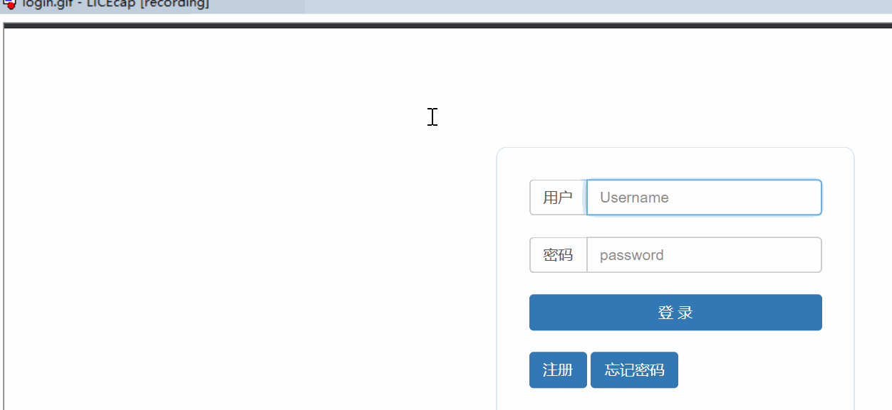
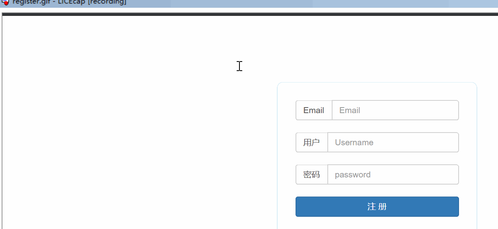
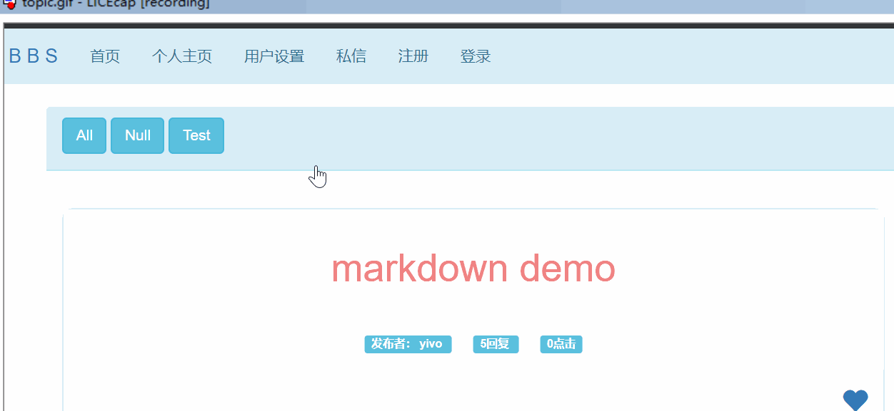
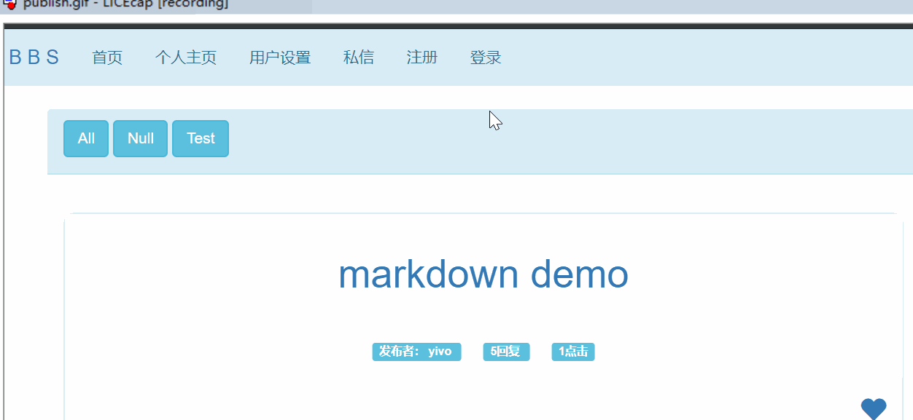
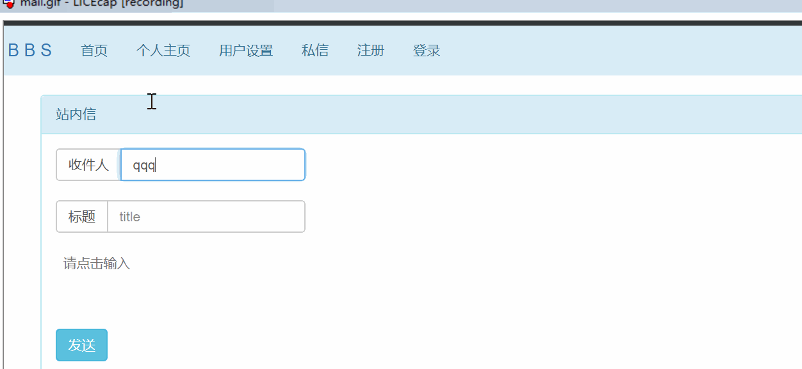

# Flask BBS

基于 Flask 框架使用 Nginx + Gunicorn + gevent + MySQL + Redis + Celery 搭建了 BBS 网站

BBS 地址： https://yivocs.cn

## 功能

### 1. 用户登录、注册、密码找回、个人主页、个人信息管理

#### - 登录展示：

#### - 注册展示：

### 2. 话题的编辑、发布、删除、评论、板块和 @ 功能

#### 主页展示：

#### 发布帖子展示：

### 3. 邮件通知与系统消息通知，用户间私信，支持系统消息和私信的批量管理

#### 发信展示：

## 数据库

- 数据存储使用 MySQL + Redis，ORM 使用了 SQLAlchemy

- 使用服务器端 Session 实现了用户登录的管理并且使用 Redis 存储了 Session 以及页面的 XSRF Token

- 对导致性能瓶颈的数据进行了数据库优化以及基于 Redis 的缓存优化，使用 Celery 消息队列提高了用户体验

## 安全

- 配置了 SSL 证书，使用 HTTPS 安全协议

- 使用 Redis 存储 XSRF Token 有效防御 XSRF 攻击

- 对用户输入的部分关键信息进行转义 有效防御 XSS 攻击

- 使用 ORM 而非直接使用 SQL 语句操作数据库 有效防御 SQL 注入攻击

- 用户密码使用 SHA256 加盐存储，最大力度保护用户安全

## 部署

- 项目使用 Nginx 作为反向代理，过滤了静态资源请求，再用 Gunicorn 多 Worker + gevent 协程架构提高性能
 
- 使用 Shell/Bash 脚本实现了 HTTPS 网站项目的一键部署
